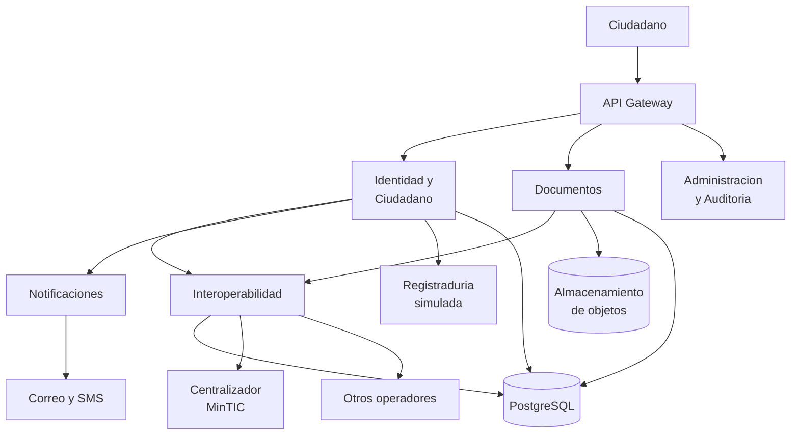
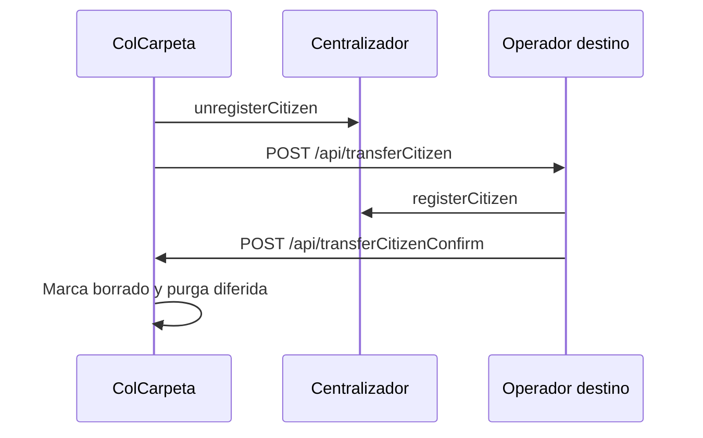
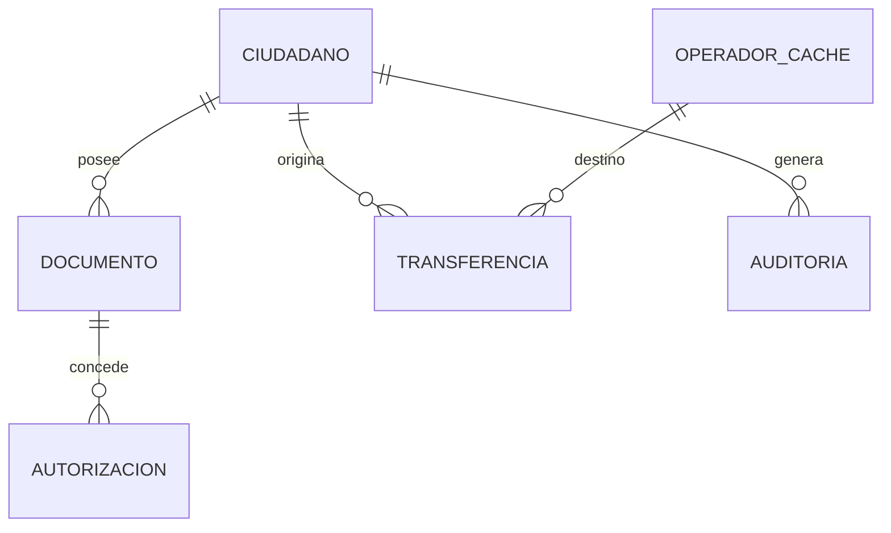
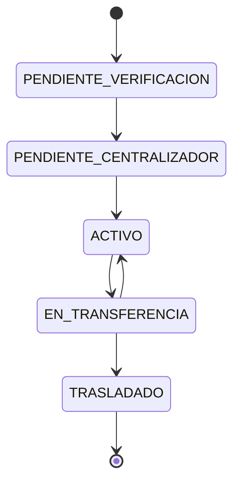
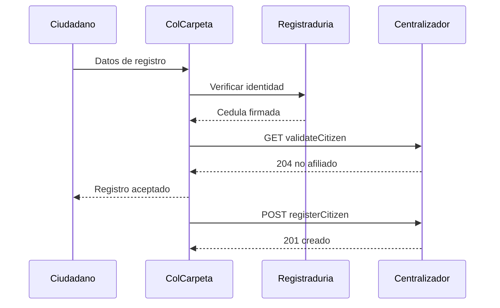
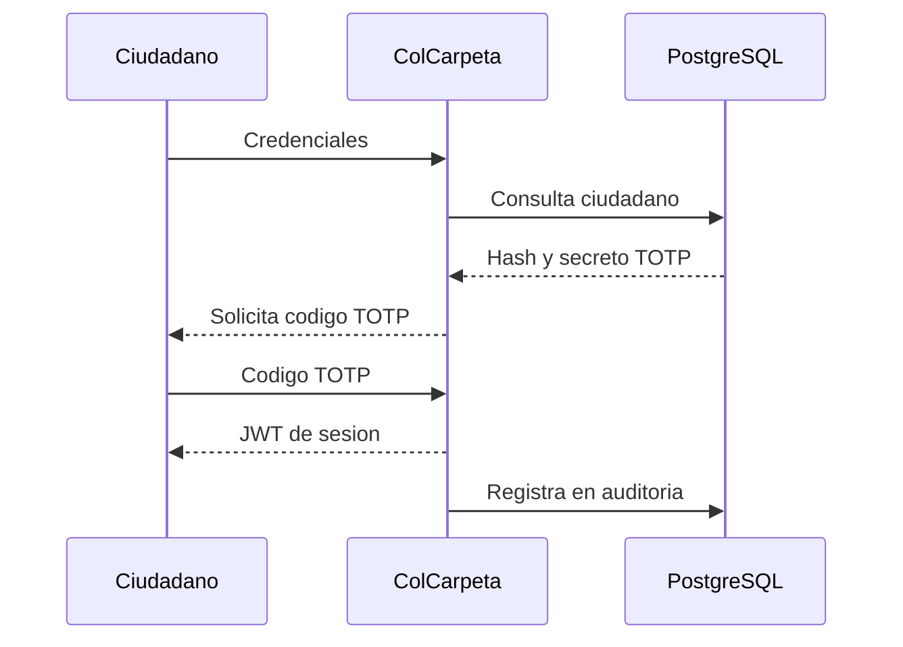
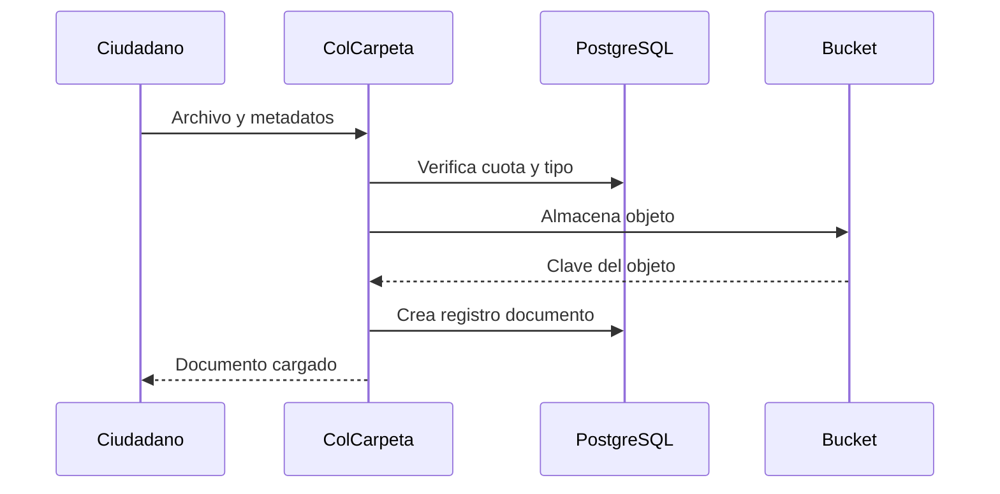
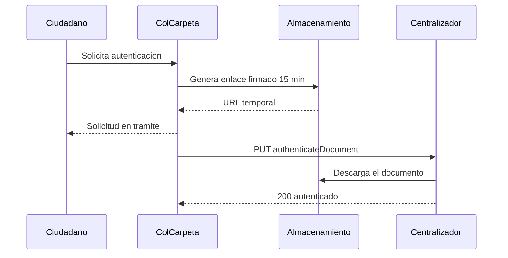
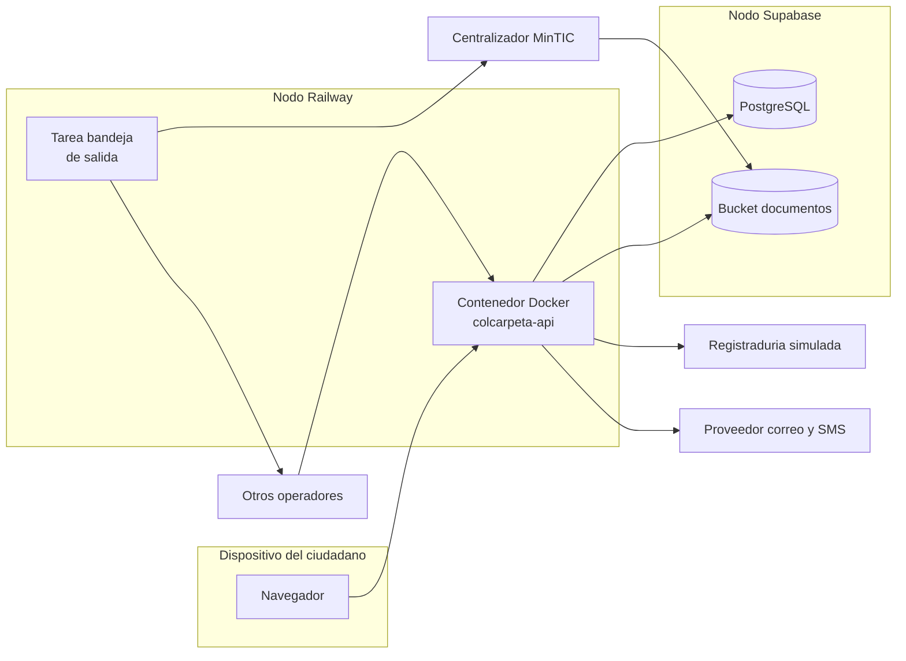

# Especificación Técnica — Operador ColCarpeta

2026-09-20 · Jorge Andrés Duran Cotamo, Angel David Martínez Doria, Valeria Cardona Urrea

ColCarpeta es el Operador de Carpeta Ciudadana del equipo, registrado ante el centralizador del MinTIC con identificador `6aaeb415b765590002607402`. Este documento fija la identificación del operador, la arquitectura, el stack, la infraestructura de despliegue, los contratos de integración y las reglas de operación.

## Identificación del operador

| Campo | Valor |
| --- | --- |
| Nombre del operador | ColCarpeta |
| Identificador ante el MinTIC | `6aaeb415b765590002607402` |
| Participantes | Jorge Andrés Duran Cotamo, Angel David Martínez Doria, Valeria Cardona Urrea |
| Curso | Arquitecturas Avanzadas de Software |
| Registro verificado en el directorio | Sí, vía `GET /apis/getOperators` |
| Endpoint de transferencia publicado | No |
| Repositorio | `https://github.com/Angel2327/ColCarpeta-AAS` |
| Aplicación desplegada | `https://colcarpeta-aas-production.up.railway.app` |

El identificador viaja como `operatorId` en `registerCitizen` y `unregisterCitizen`, y como `idOperator` en `registerTransferEndPoint`. Se almacena en la variable de entorno `OPERATOR_ID` y nunca se escribe en el código.

El nombre `ColCarpeta` es único en el directorio de 73 operadores, por lo que identifica la entrada del equipo sin ambigüedad.

Pendiente de confirmar: dirección y correo de contacto usados en el registro.

## Arquitectura



### Componentes lógicos

| Componente | Responsabilidad | Requerimientos |
| --- | --- | --- |
| API Gateway | Terminación TLS, enrutamiento, validación de sesión, límite de tasa, identificador de correlación | Transversal |
| Identidad y Ciudadano | Registro, verificación ante Registraduría, afiliación, cuenta de correo, inicio de sesión y segundo factor | RF1–RF9 |
| Documentos | Carga, metadatos, clasificación, firma, validación, cuotas, retención y paquetes | RF10–RF16, RF27 |
| Interoperabilidad | Único componente que habla con el centralizador y con otros operadores; bandeja de salida, caché del directorio, endpoints de transferencia | RF17–RF28 |
| Notificaciones | Correo, SMS y bandeja de notificaciones | RF29–RF31 |
| Administración y Auditoría | Autorizaciones, registro de auditoría, consola, planes y reportes | RF32–RF37 |

Ningún componente distinto de Interoperabilidad emite llamadas al centralizador ni a otros operadores.

### Componentes técnicos desplegados

| Unidad desplegable | Contenido | Plataforma |
| --- | --- | --- |
| `colcarpeta-api` | Los seis componentes lógicos como módulos de una sola aplicación FastAPI | Railway |
| Proceso de bandeja de salida | Tarea en segundo plano dentro de `colcarpeta-api` que drena la tabla `outbox` | Railway |
| Base de datos | PostgreSQL | Supabase |
| Almacenamiento de objetos | Bucket privado compatible con S3 | Supabase Storage |

La arquitectura objetivo separa Interoperabilidad y su proceso de bandeja de salida en una segunda unidad desplegable. Esa separación no se ejecuta en esta entrega.

## Stack tecnológico

| Capa | Tecnología |
| --- | --- |
| Lenguaje | Python 3.12 |
| Framework web | FastAPI sobre Uvicorn |
| Validación de esquemas | Pydantic v2 |
| Acceso a datos | SQLAlchemy 2.x con Alembic para migraciones |
| Cliente HTTP saliente | httpx en modo asíncrono |
| Base de datos | PostgreSQL |
| Almacenamiento de objetos | Cliente boto3 contra endpoint compatible con S3 |
| Contraseñas | Argon2 (`argon2-cffi`) |
| Sesión | JWT firmado con RS256 |
| Segundo factor | TOTP (`pyotp`) |
| Firma y validación de documentos | `pyhanko` para PAdES, `cryptography` para el resto |
| Empaquetado | Docker |
| Documentación de API | OpenAPI generado por FastAPI en `/docs` |
|  |  |

El cliente HTTP debe emitir `DELETE` con cuerpo, requisito de `unregisterCitizen`. En httpx se construye con `client.request("DELETE", url, json=payload)`; el atajo `client.delete()` no admite cuerpo.

Pendiente de decidir: tecnología del portal del ciudadano y proveedor de correo y SMS.

## Infraestructura y despliegue

Railway aloja el cómputo. Supabase aloja los datos y los archivos. Los dos proveedores no se comunican entre sí: la aplicación es el único cliente de ambos y se conecta por credenciales en variables de entorno.

| Recurso | Proveedor | Detalle |
| --- | --- | --- |
| Aplicación `colcarpeta-api` | Railway | Servicio desde el repositorio, HTTPS, sin suspensión por inactividad |
| Base de datos | Supabase | PostgreSQL gestionado |
| Almacenamiento | Supabase Storage | Bucket privado `documentos`, endpoint compatible con S3 |

### Direcciones públicas

La dirección estable del servicio es el dominio que asigna Railway, no una dirección IP. Railway no asigna IP fija saliente ni entrante en los planes básicos, y la IP de los contenedores cambia entre despliegues. Todo registro ante el MinTIC y todo intercambio con otros operadores usa el dominio con HTTPS; no se publica ninguna IP ni ninguna URL `http://`.

| Ruta | Método | Expuesta a |
| --- | --- | --- |
| `/api/transferCitizen` | POST | Otros operadores |
| `/api/transferCitizenConfirm` | POST | Otros operadores |
| `/health` | GET | Monitoreo |
| `/docs` | GET | Documentación OpenAPI |

El dominio asignado es `colcarpeta-aas-production.up.railway.app`. Se registra en `PUBLIC_BASE_URL` y es el que se publicará con `registerTransferEndPoint`. Ese registro se ejecuta únicamente cuando las dos rutas de transferencia responden correctamente.

### Variables de entorno

```
DATABASE_URL=postgresql://...            # Supabase, sección Database
S3_ENDPOINT=https://<proyecto>.supabase.co/storage/v1/s3
S3_REGION=us-west-2
S3_ACCESS_KEY=...                        # Supabase, seccion Storage
S3_SECRET_KEY=...
S3_BUCKET=documentos
OPERATOR_ID=6aaeb415b765590002607402
OPERATOR_NAME=ColCarpeta
GOVCARPETA_URL=https://govcarpeta-apis-4905ff3c005b.herokuapp.com
PUBLIC_BASE_URL=https://colcarpeta-aas-production.up.railway.app
JWT_PRIVATE_KEY=...
JWT_PUBLIC_KEY=...
PRESIGNED_URL_TTL_AUTH=900               # segundos, autenticacion de documentos
PRESIGNED_URL_TTL_TRANSFER=86400         # segundos, transferencia entre operadores
TRANSFER_CONFIRM_TIMEOUT=14400           # segundos sin confirmacion antes de verificar
PURGE_DELAY_DAYS=30
CUOTA_CIUDADANO_BYTES=209715200
TOTP_MODO=simulado                       # simulado | real
TOTP_CODIGO_SIMULADO=000000
REGISTRADURIA_API_KEY=...
```

Ningún valor de esta lista se escribe en el repositorio. El archivo `.env.example` contiene solo los nombres.

### Secuencia de despliegue

1. Crear el proyecto en Supabase, crear el bucket privado `documentos` y copiar la cadena de conexión y las credenciales de S3.
2. Crear el servicio en Railway apuntando al repositorio.
3. Cargar las variables de entorno en Railway.
4. Desplegar y verificar `/health` y `/docs`.
5. Ejecutar las migraciones de Alembic contra la base de Supabase.
6. Registrar los endpoints de transferencia ante el MinTIC solo cuando estén operativos.

## Integración con el centralizador

Base: `https://govcarpeta-apis-4905ff3c005b.herokuapp.com`. La API no exige autenticación de ningún tipo. Contratos verificados contra el servicio en producción el 19 de septiembre de 2026.

| Operación | Método y ruta | Cuerpo |
| --- | --- | --- |
| Validar ciudadano | `GET /apis/validateCitizen/{id}` | Sin cuerpo |
| Registrar ciudadano | `POST /apis/registerCitizen` | `id`, `name`, `address`, `email`, `operatorId`, `operatorName` |
| Desligar ciudadano | `DELETE /apis/unregisterCitizen` | `id`, `operatorId`, `operatorName` |
| Autenticar documento | `PUT /apis/authenticateDocument` | `idCitizen`, `UrlDocument`, `documentTitle` |
| Registrar operador | `POST /apis/registerOperator` | `name`, `address`, `contactMail`, `participants` |
| Publicar endpoints | `PUT /apis/registerTransferEndPoint` | `idOperator`, `endPoint`, `endPointConfirm` |
| Consultar operadores | `GET /apis/getOperators` | Sin cuerpo |

### validateCitizen

La semántica de los códigos es inversa a la convención habitual.

| Código | Significado | Acción |
| --- | --- | --- |
| `204` | El ciudadano no está afiliado a ningún operador | Continúa el registro |
| `200` | El ciudadano ya está afiliado | Bloquea el registro |
| `500`, `501` | Error del centralizador | Reintento |

El cuerpo del `200` es texto plano y nombra al operador actual: `El ciudadano con id: 1234567890 se encuentra registrado en el operador: Operador Ciudadano`. La decisión se toma siempre por el código HTTP; el texto se usa solo como dato informativo, nunca como condición.

### registerCitizen

`id` es numérico. `email` es la cuenta generada por el operador. Respuestas: `201` creado, `501` el ciudadano ya se encuentra registrado, `500` error de aplicación.

### unregisterCitizen

Verbo `DELETE` con cuerpo JSON. Respuestas: `201` eliminado, `204` sin contenido, `500` y `501` error.

### authenticateDocument

El campo se llama `UrlDocument`, con `U` mayúscula inicial. El centralizador descarga esa URL, por lo que debe ser alcanzable desde internet sin credenciales. Respuestas: `200` correcto, `204` sin contenido, `500` y `501` error.

### registerOperator

La especificación declara como obligatorios `nameOperator` y `adress`, pero define las propiedades `name` y `address`. Se envían las cuatro claves en la misma petición. La operación no devuelve el identificador: se obtiene consultando `getOperators` y leyendo el campo `_id` de la entrada propia. Operación ya ejecutada para ColCarpeta.

### getOperators

Devuelve `_id`, `operatorName`, `participants` y, cuando existe, `transferAPIURL`. No devuelve el endpoint de confirmación aunque `registerTransferEndPoint` lo acepte.

Estado del directorio al 19 de septiembre de 2026: 73 operadores, de los cuales 16 publican `transferAPIURL`. Hay nombres de operador duplicados, URLs con espacios al inicio y URLs sin TLS. El consumo del directorio aplica recorte de espacios, descarta entradas sin `transferAPIURL` y resuelve por `_id`, nunca por `operatorName`.

## Interoperabilidad entre operadores

ColCarpeta adopta el formato acordado entre los equipos del curso, sin modificaciones en los campos acordados.



### Contratos

`POST /api/transferCitizen` — recepción de un ciudadano.

```
{
  "id": 1032236578,
  "citizenName": "Carlos Castro",
  "citizenEmail": "carlos@carpetacolombia.co",
  "urlDocuments": { "Diploma de grado": "https://...", "Cedula": "https://..." },
  "confirmAPI": "https://colcarpeta-aas-production.up.railway.app/api/transferCitizenConfirm"
}
```

`POST /api/transferCitizenConfirm` — confirmación de recepción.

```
{ "id": 1032236578, "req_status": 1 }
```

`req_status` vale `1` en éxito y `0` en fallo.

### Extensiones al enviar

Se agregan dos elementos que los operadores que no los reconozcan ignoran sin romperse.

| Elemento | Forma |
| --- | --- |
| Título del documento | Se usa como clave dentro de `urlDocuments`, en lugar de `URL1`, `URL2` |
| Metadatos | Arreglo adicional `documentsMetadata` con tipo, entidad emisora, fecha y estado de certificación |
| Correo personal de contacto | Campo adicional `contactEmail`. El campo acordado `citizenEmail` transporta la cuenta del operador, que es el identificador inmutable del ciudadano (AD-10) |

### Tolerancia al recibir

`urlDocuments` se acepta en tres formas y se normaliza internamente: texto suelto, arreglo de textos y objeto de clave a valor. Los campos desconocidos se ignoran. Si `documentsMetadata` no viene, el documento se almacena marcado como `metadatos no suministrados por el operador de origen`.

`citizenEmail` se adopta como `email_carpeta` del ciudadano tal como llega, sin importar el dominio y sin generar una dirección propia (AD-10). Si `contactEmail` no viene, `email_personal` queda vacío y se solicita al ciudadano en su primer inicio de sesión. Si `citizenEmail` llega vacío o con formato inválido —operador de origen que no respeta el acuerdo—, se genera una dirección propia con el patrón habitual y se deja constancia en la auditoría.

### Orden de envío

1. Generar enlaces firmados con vigencia de 24 horas para todos los documentos del ciudadano.
2. Invocar `unregisterCitizen` en el centralizador.
3. Invocar `POST /api/transferCitizen` del operador destino, resuelto por `transferAPIURL` del directorio, enviando `email_carpeta` en `citizenEmail` y `email_personal` en `contactEmail`.
4. Marcar la transferencia como `ENVIADA` y esperar la confirmación.
5. Al recibir `req_status = 1`, marcar como `CONFIRMADA` y programar la purga.
6. Al recibir `req_status = 0`, invocar `registerCitizen` para recuperar al ciudadano y notificarle.

### Orden de recepción

1. Validar tamaño y cantidad de documentos contra los límites configurados.
2. Crear el ciudadano adoptando `citizenEmail` como su `email_carpeta`, sin generar una dirección propia.
3. Descargar todos los archivos y almacenarlos en el bucket.
4. Validar las firmas digitales.
5. Invocar `validateCitizen` y `registerCitizen` en el centralizador.
6. Invocar `confirmAPI` con `req_status = 1` solo cuando los pasos anteriores hayan terminado. Ante cualquier fallo, invocar con `req_status = 0`.

### Aceptación de confirmaciones

Una confirmación entrante se procesa solo si la cédula está en estado `ENVIADA` y el origen corresponde al operador destino de esa transferencia. Toda confirmación que no cumpla ambas condiciones se registra en auditoría y se descarta. Las confirmaciones repetidas para la misma cédula no producen efecto adicional.

Si transcurre `TRANSFER_CONFIRM_TIMEOUT` sin confirmación, se consulta `validateCitizen` para esa cédula. Si el resultado es `200` y el texto nombra al operador destino, la transferencia se cierra como `CONFIRMADA`. Si el resultado es `204`, se ejecuta la recuperación con `registerCitizen`.

## Modelo de datos

| Tabla | Campos principales |
| --- | --- |
| `ciudadano` | `id` (cédula, numérico, clave primaria), `nombre`, `direccion`, `email_carpeta`, `email_personal`, `telefono`, `password_hash`, `totp_secret`, `estado`, `identidad_verificada`, `creado_en` |
| `documento` | `id`, `ciudadano_id`, `titulo`, `tipo`, `entidad_emisora`, `fecha_emision`, `s3_key`, `content_type`, `tamano_bytes`, `hash_sha256`, `certificado`, `estado_autenticacion`, `firma_valida`, `creado_en` |
| `outbox` | `id`, `operacion`, `payload`, `estado`, `intentos`, `proximo_intento`, `ultimo_error`, `creado_en` |
| `transferencia` | `id`, `ciudadano_id`, `operador_destino_id`, `confirm_api`, `estado`, `enviada_en`, `confirmada_en`, `purgar_despues_de` |
| `operador_cache` | `id`, `nombre`, `transfer_api_url`, `actualizado_en` |
| `autorizacion` | `id`, `documento_id`, `tercero`, `otorgada_en`, `vence_en`, `revocada_en` |
| `auditoria` | `id`, `momento`, `actor`, `accion`, `recurso`, `correlation_id`, `detalle` |

`auditoria` es de solo inserción. No se define operación de actualización ni de borrado sobre esa tabla.

Los archivos no se guardan en la base de datos. `documento.s3_key` es la única referencia al objeto almacenado.

### Relaciones



| Relación | Cardinalidad | Regla |
| --- | --- | --- |
| `ciudadano` a `documento` | Uno a muchos | Un documento pertenece a un solo ciudadano |
| `ciudadano` a `transferencia` | Uno a muchos | Solo una transferencia puede estar en estado `ENVIADA` por ciudadano |
| `documento` a `autorizacion` | Uno a muchos | Las autorizaciones son por documento y por operación |
| `operador_cache` a `transferencia` | Uno a muchos | El operador destino se referencia por su `_id` del directorio |
| `ciudadano` a `auditoria` | Uno a muchos | Los eventos sin ciudadano asociado quedan con actor del sistema |
| `outbox` | Sin clave foránea | Referencia lógica al recurso por tipo de operación e identificador |

### Estados del ciudadano



### Otros estados

| Entidad | Estados |
| --- | --- |
| `documento.estado_autenticacion` | `NO_SOLICITADA`, `PENDIENTE`, `AUTENTICADO`, `RECHAZADO` |
| `documento.certificado` | `true` para documentos firmados por una entidad, `false` para temporales |
| `outbox.estado` | `PENDIENTE`, `EN_PROCESO`, `COMPLETADO`, `FALLIDO` |
| `transferencia.estado` | `ENVIADA`, `CONFIRMADA`, `PURGADA`, `FALLIDA` |

## Seguridad y manejo de documentos

### Almacenamiento

El bucket es privado y no admite acceso anónimo. El cifrado en reposo lo aplica el proveedor de almacenamiento. Todo tráfico externo usa TLS. Las claves de objeto se generan como identificadores aleatorios y no contienen la cédula ni el nombre del ciudadano.

### Enlaces firmados

La única forma en que un tercero accede a un documento es un enlace firmado generado en el momento de la solicitud.

| Destino | Vigencia | Variable |
| --- | --- | --- |
| Centralizador, para `authenticateDocument` | 15 minutos | `PRESIGNED_URL_TTL_AUTH` |
| Operador destino, durante una transferencia | 24 horas | `PRESIGNED_URL_TTL_TRANSFER` |

Cada generación de un enlace firmado se registra en `auditoria` con el documento, el destino y el momento. El enlace vence por tiempo; no se publica ningún objeto de forma permanente.

### Acceso del ciudadano

| Control | Definición |
| --- | --- |
| Contraseña | Argon2id |
| Sesión | JWT RS256 con vencimiento y expiración por inactividad |
| Segundo factor | TOTP, exigido en operaciones sensibles |
| Autorizaciones | Por documento y por operación, revocables, registradas en `auditoria` |

### Endpoints de transferencia

El formato acordado entre operadores no define autenticación. Los controles aplicados son propios y no dependen del otro operador.

- Una confirmación se procesa solo si la cédula está en estado `ENVIADA` y el origen corresponde al destino registrado de esa transferencia.
- Las peticiones entrantes tienen límite de tamaño total, límite de cantidad de documentos y límite de tasa por origen.
- Los documentos recibidos entran en cuarentena hasta validar su firma.
- Toda petición entrante, aceptada o rechazada, queda en `auditoria`.

### Borrado

El borrado es diferido. Al confirmarse una transferencia, el ciudadano y sus documentos se marcan como borrados y dejan de ser accesibles; la purga física ocurre `PURGE_DELAY_DAYS` días después. Los documentos certificados no admiten borrado a solicitud del ciudadano mientras esté afiliado. La purga posterior a una transferencia confirmada no es una excepción a esa regla: el ciudadano deja de estar afiliado a ColCarpeta y sus documentos ya residen en el operador destino.

### Datos enviados al centralizador

Hacia el centralizador solo salen identificadores, nombre, dirección, correo y enlaces. Ningún archivo se transmite al centralizador. Los secretos y credenciales viven en variables de entorno y no se registran en los logs.

## Flujos implementados

### 1. Registro del ciudadano



1. El ciudadano envía cédula, nombre, dirección, correo personal, teléfono y contraseña.
2. El sistema valida formato y ausencia de la cédula en la base local.
3. El sistema consulta a la Registraduría y obtiene el documento de identidad firmado.
4. El sistema invoca `GET /apis/validateCitizen/{id}`. Con `200` rechaza el registro e informa el operador actual. Con `204` continúa.
5. El sistema crea el ciudadano en estado `PENDIENTE_CENTRALIZADOR` y genera `email_carpeta` con el patrón `nombre.apellido.año@carpetacolombia.co`, resolviendo colisiones con un sufijo numérico.
6. El sistema escribe la operación `registerCitizen` en `outbox` y responde al ciudadano.
7. El proceso de bandeja de salida invoca `POST /apis/registerCitizen`. Con `201` el ciudadano pasa a `ACTIVO`.
8. El sistema carga el documento de identidad en la carpeta y encola su autenticación.
9. El sistema notifica al correo personal.

### 2. Inicio de sesión



1. El ciudadano envía `email_carpeta` o cédula y contraseña.
2. El sistema verifica la contraseña contra el hash Argon2id.
3. El sistema exige el código TOTP cuando el ciudadano lo tiene habilitado o la operación es sensible.
4. El sistema emite el JWT de sesión con vencimiento.
5. El sistema registra el acceso, exitoso o fallido, en `auditoria`.

Los intentos fallidos consecutivos aplican bloqueo temporal por cédula y por dirección de origen.

### 3. Carga de documentos



1. El ciudadano envía el archivo y sus metadatos como `multipart/form-data`.
2. El sistema valida tipo, tamaño y cuota disponible. Los documentos temporales están sujetos a cuota; los certificados no.
3. El sistema calcula `hash_sha256`.
4. El sistema almacena el objeto en el bucket bajo una clave aleatoria.
5. El sistema crea el registro en `documento` con sus metadatos mínimos: tipo, entidad, fecha y contexto.
6. Si el archivo trae firma digital, el sistema la valida y guarda el resultado en `firma_valida`.
7. El sistema registra la operación en `auditoria`.

### 4. Autenticación de documentos ante GovCarpeta



1. El ciudadano solicita la autenticación de un documento de su carpeta.
2. El sistema genera un enlace firmado con vigencia de 15 minutos.
3. El sistema escribe la operación en `outbox` y marca el documento como `PENDIENTE`.
4. El proceso de bandeja de salida invoca `PUT /apis/authenticateDocument` con `idCitizen`, `UrlDocument` y `documentTitle`.
5. Con `200` el documento pasa a `AUTENTICADO`. Con `500` o `501` la operación se reintenta. Agotados los reintentos, pasa a `RECHAZADO`.
6. El sistema guarda la respuesta del centralizador junto al documento y notifica al ciudadano.

## Reglas de operación

### Llamadas al centralizador

`validateCitizen` es la única llamada síncrona dentro de una petición del ciudadano. Las demás se escriben en `outbox` dentro de la misma transacción que la operación de negocio y las ejecuta el proceso de bandeja de salida.

| Parámetro | Valor |
| --- | --- |
| Tiempo de conexión | 5 segundos |
| Tiempo de lectura | 30 segundos |
| Intervalo del proceso de bandeja | 10 segundos |
| Reintentos | 5, con espera exponencial de 1, 2, 4, 8 y 16 minutos |
| Estado tras agotar reintentos | `FALLIDO`, visible en la consola de administración |

Se reintenta ante `500`, `501`, tiempo de espera agotado y error de red. No se reintenta ante `201` ni ante `501` de `registerCitizen` cuando el texto indica que el ciudadano ya está registrado.

### Idempotencia

| Operación | Clave de idempotencia |
| --- | --- |
| Entradas en `outbox` | `operacion` más identificador del recurso |
| `POST /api/transferCitizen` | `id` del ciudadano; una transferencia ya recibida no se procesa dos veces |
| `POST /api/transferCitizenConfirm` | `id` del ciudadano; solo la primera confirmación produce efecto |
| Carga de documentos | `hash_sha256` por ciudadano |

### Directorio de operadores

Se consulta `getOperators` y se guarda en `operador_cache`. El refresco es cada 15 minutos y también a demanda antes de cada envío. Las entradas sin `transferAPIURL` se descartan para enrutamiento. El valor de `transferAPIURL` se recorta de espacios antes de usarse.

Cuando el operador destino no publica `transferAPIURL`, la entrega de documentos se hace por correo electrónico.

### Tiempos de espera de transferencia

| Evento | Valor |
| --- | --- |
| Espera de confirmación antes de verificar contra el centralizador | `TRANSFER_CONFIRM_TIMEOUT` |
| Vigencia de los enlaces entregados al operador destino | 24 horas |
| Demora de la purga física tras confirmar | `PURGE_DELAY_DAYS` |

### Trazabilidad

Cada petición recibe un identificador de correlación que se propaga a las llamadas salientes y se escribe en `auditoria` y en los logs. Los logs son estructurados y no contienen credenciales, tokens ni enlaces firmados completos.

## Estado de la implementación y pendientes

| Elemento | Estado |
| --- | --- |
| Registro del operador ante el MinTIC | Hecho |
| Proyecto Supabase, base de datos y bucket | Hecho |
| Despliegue en Railway | Hecho, `https://colcarpeta-aas-production.up.railway.app` |
| Flujo 1, registro del ciudadano (CU-01) | Hecho y probado contra el centralizador real |
| Flujo 2, inicio de sesión (CU-02) | Hecho |
| Flujo 3, carga de documentos (CU-05) | Hecho |
| Flujo 4, autenticación ante GovCarpeta (CU-11) | Hecho y probado contra el centralizador real |
| Validación de firma digital (CU-09) | Sin implementar; requiere validar firmas PAdES en el PDF |
| Publicación de endpoints de transferencia | Pendiente, condicionada a que las rutas respondan |
| Transferencia entre operadores | Diseñada, sin implementar |
| Notificaciones | Alcance reducido al correo de registro |
| Administración y auditoría | Librería compartida de auditoría, sin consola |
| Registraduría | Simulada |
| Segundo factor | Flujo completo implementado; verificación del código en modo simulado |

### Diferencias con la arquitectura objetivo

| Arquitectura objetivo | Implementación actual |
| --- | --- |
| Interoperabilidad como unidad desplegable independiente | Módulo dentro de `colcarpeta-api` |
| Despliegue multizona con réplicas | Instancia única |
| Bloqueo de objetos en modo cumplimiento para documentos certificados | Restricción aplicada en la aplicación |
| Llaves de firma en HSM o servicio de llaves gestionado | Llaves en variables de entorno |
| Broker de mensajería dedicado | Tabla `outbox` en PostgreSQL |

### Decisiones pendientes

- Tecnología del portal del ciudadano.
- Proveedor de correo y de SMS.
- Recepción real de correo entrante en el dominio `carpetacolombia.co`.
- Dirección y correo de contacto usados en el registro del operador.

## Vista de despliegue

Insumo para el diagrama de despliegue.



### Nodos y artefactos

| Nodo | Artefacto desplegado | Entorno |
| --- | --- | --- |
| Dispositivo del ciudadano | Portal web | Navegador |
| Nodo Railway | Imagen Docker `colcarpeta-api` con la tarea de bandeja de salida | Contenedor gestionado |
| Nodo Supabase | Instancia PostgreSQL y bucket `documentos` | Servicios gestionados |
| Nodo MinTIC | API del centralizador | Externo, fuera del alcance |
| Nodos de otros operadores | APIs de transferencia | Externos, fuera del alcance |

### Protocolos y formatos por conexión

| Origen y destino | Protocolo | Puerto | Formato | Autenticación |
| --- | --- | --- | --- | --- |
| Navegador a `colcarpeta-api` | HTTPS sobre TLS 1.2 o superior | 443 | JSON y `multipart/form-data` | JWT en cabecera `Authorization` |
| `colcarpeta-api` a PostgreSQL | Protocolo PostgreSQL sobre TLS | 5432 | Binario | Usuario y contraseña |
| `colcarpeta-api` a bucket | HTTPS, API compatible con S3 | 443 | Binario del objeto, XML de control | Firma SigV4 |
| Bandeja de salida a centralizador | HTTPS, REST | 443 | JSON | Ninguna |
| Bandeja de salida a otros operadores | HTTPS, REST | 443 | JSON | Ninguna |
| Otros operadores a `colcarpeta-api` | HTTPS, REST | 443 | JSON | Ninguna, con controles propios |
| Centralizador a bucket | HTTPS, descarga directa | 443 | Binario del objeto | Enlace firmado con vigencia |
| `colcarpeta-api` a Registraduría simulada | HTTPS, REST | 443 | JSON | Token interno |
| `colcarpeta-api` a proveedor de correo y SMS | HTTPS, REST | 443 | JSON | Clave de API |

Ninguna conexión usa direcciones IP. Todas resuelven por nombre de dominio.

## Inventario de actores y casos de uso

Insumo para el diagrama de casos de uso.

### Actores

| Actor | Tipo |
| --- | --- |
| Ciudadano | Primario |
| Entidad pública | Primario |
| Empresa privada | Primario |
| Administrador del operador | Primario |
| Centralizador del MinTIC | Secundario, sistema |
| Registraduría Nacional | Secundario, sistema |
| Otro operador de carpeta | Secundario, sistema |
| Proveedor de correo y SMS | Secundario, sistema |

### Casos de uso

| ID | Caso de uso | Actor primario | RF |
| --- | --- | --- | --- |
| CU-01 | Registrarse en el operador | Ciudadano | RF1–RF6 |
| CU-02 | Iniciar sesión | Ciudadano | RF7 |
| CU-03 | Solicitar traslado a otro operador | Ciudadano | RF8 |
| CU-04 | Registrar entidad o empresa | Entidad pública, Empresa privada | RF9 |
| CU-05 | Cargar documento | Ciudadano | RF10 |
| CU-06 | Consultar y descargar documentos | Ciudadano | RF11 |
| CU-07 | Buscar y clasificar documentos | Ciudadano | RF12, RF13 |
| CU-08 | Eliminar documento no certificado | Ciudadano | RF14 |
| CU-09 | Validar firma digital | Sistema | RF15 |
| CU-10 | Sustituir documento temporal | Ciudadano | RF16 |
| CU-11 | Solicitar autenticación de documento | Ciudadano | RF20 |
| CU-12 | Enviar documentos a una entidad | Ciudadano | RF23, RF24, RF27 |
| CU-13 | Recibir documentos de una entidad u operador | Entidad pública, Otro operador | RF22 |
| CU-14 | Solicitar documentos a una entidad | Ciudadano | RF25 |
| CU-15 | Autorizar o rechazar petición de documentos | Ciudadano | RF26 |
| CU-16 | Recibir ciudadano transferido | Otro operador | RF21 |
| CU-17 | Consultar centro de notificaciones | Ciudadano | RF31 |
| CU-18 | Gestionar autorizaciones de acceso | Ciudadano | RF32 |
| CU-19 | Consultar auditoría de accesos | Ciudadano | RF33 |
| CU-20 | Crear caso de soporte y solicitar documentos | Empresa privada | RF34 |
| CU-21 | Administrar planes y facturación | Administrador | RF35 |
| CU-22 | Operar consola de administración | Administrador | RF36 |
| CU-23 | Generar reportes analíticos | Administrador | RF37 |

### Relaciones

| Relación | Detalle |
| --- | --- |
| CU-01 `include` CU-11 | El registro autentica el documento de identidad |
| CU-05 `include` CU-09 | Toda carga valida la firma cuando el archivo la trae |
| CU-13 `include` CU-09 | Todo documento recibido valida la firma |
| CU-12 `extend` | Entrega por correo cuando el destinatario no está afiliado a ningún operador |
| CU-03 `include` CU-16 | La transferencia saliente invoca la recepción en el operador destino |

RF17, RF18, RF19, RF28, RF29 y RF30 no generan casos de uso propios: son funciones del sistema y quedan incluidas en los casos de uso anteriores.

Los casos de uso con especificación detallada en esta entrega son CU-01, CU-02, CU-05 y CU-11.

## Interfaces de los componentes

Insumo para el diagrama de componentes. Las interfaces se describen por responsabilidad y operaciones, no por rutas HTTP.

### Interfaces expuestas

| Componente | Interfaz | Operaciones |
| --- | --- | --- |
| API Gateway | `IPortal` | Enrutar, validar sesión, limitar tasa, asignar correlación |
| API Gateway | `ITransferenciaEntrante` | Recibir ciudadano, recibir confirmación |
| Identidad y Ciudadano | `IGestionCiudadano` | Registrar, consultar, cambiar estado, generar cuenta de correo |
| Identidad y Ciudadano | `IAutenticacion` | Autenticar, emitir sesión, validar sesión, habilitar segundo factor |
| Documentos | `IGestionDocumental` | Cargar, listar, buscar, descargar, eliminar, sustituir |
| Documentos | `IValidacionFirma` | Validar firma, registrar resultado |
| Documentos | `IEnlaceTemporal` | Generar enlace firmado con vigencia |
| Interoperabilidad | `IAfiliacion` | Validar disponibilidad, afiliar, desafiliar |
| Interoperabilidad | `IAutenticacionDocumento` | Solicitar autenticación, consultar resultado |
| Interoperabilidad | `IDirectorio` | Resolver operador, listar operadores |
| Interoperabilidad | `ITransferencia` | Enviar ciudadano, recibir ciudadano, confirmar recepción |
| Notificaciones | `INotificacion` | Enviar correo, enviar SMS, listar bandeja |
| Administración y Auditoría | `IAutorizacion` | Otorgar, consultar, revocar |
| Administración y Auditoría | `IAuditoria` | Registrar evento, consultar eventos |
| Administración y Auditoría | `IAdministracion` | Consultar métricas, gestionar cuentas y cuotas |

### Interfaces consumidas

| Componente | Consume |
| --- | --- |
| API Gateway | `IGestionCiudadano`, `IAutenticacion`, `IGestionDocumental`, `ITransferencia`, `IAutorizacion` |
| Identidad y Ciudadano | `IRegistraduria`, `IAfiliacion`, `INotificacion`, `IAuditoria` |
| Documentos | `IAlmacenamientoObjetos`, `IAutenticacionDocumento`, `IAutorizacion`, `IAuditoria` |
| Interoperabilidad | `ICentralizador`, `IOperadorPar`, `IGestionDocumental`, `IEnlaceTemporal`, `IAuditoria` |
| Notificaciones | `IProveedorMensajeria`, `IAuditoria` |
| Administración y Auditoría | Ninguna |

### Interfaces externas

| Interfaz | Sistema |
| --- | --- |
| `ICentralizador` | API del MinTIC |
| `IOperadorPar` | API de transferencia de otros operadores |
| `IRegistraduria` | Servicio de verificación de identidad, simulado |
| `IAlmacenamientoObjetos` | Bucket compatible con S3 |
| `IProveedorMensajeria` | Proveedor de correo y SMS |

`ICentralizador` e `IOperadorPar` las consume únicamente el componente de Interoperabilidad.

## Decisiones de arquitectura

### Criterios de ubicación de componentes

Cada componente se ubica evaluando seis criterios en este orden.

| Criterio | Pregunta |
| --- | --- |
| Sensibilidad del dato | ¿El componente trata datos personales o documentos del ciudadano? |
| Dependencia de terceros estatales | ¿Requiere un canal dedicado con una entidad del Estado? |
| Elasticidad | ¿Su carga varía con el número de ciudadanos atendidos? |
| Cumplimiento | ¿La normatividad restringe dónde puede residir? |
| Costo y operación | ¿El equipo puede operarlo con el esfuerzo disponible? |
| Disponibilidad | ¿Su caída interrumpe un trámite del ciudadano? |

| Componente | Ubicación | Criterio determinante |
| --- | --- | --- |
| Portal, gateway y servicios de aplicación | Nube pública | Elasticidad y disponibilidad |
| Base de datos y almacenamiento de documentos | Nube pública | Elasticidad, con cumplimiento satisfecho por cifrado y control de acceso |
| Conector a la Registraduría | On-premise, red privada del operador | Dependencia de canal dedicado con entidad estatal |
| Llaves de firma y material criptográfico | Servicio gestionado de llaves u HSM | Sensibilidad del dato |
| Centralizador y operadores pares | Fuera del alcance | Sistemas de terceros |

El supuesto de la entrega 1 habilita el almacenamiento en nube fuera del país sujeto a cumplimiento normativo, por lo que la ubicación geográfica no actúa como restricción.

### AD-01. Estilo arquitectónico y unidades desplegables

**Problema.** Definir en cuántas unidades desplegables se divide la solución.

**Alternativas.** Monolito único; cinco microservicios por dominio; dos unidades con separación del componente de interoperabilidad.

**Decisión.** Seis componentes lógicos y dos unidades desplegables en la arquitectura objetivo: `colcarpeta-api` e `interoperabilidad`.

**Justificación.** El componente de interoperabilidad tiene un perfil de falla y de escalado distinto al resto porque depende de sistemas de terceros con disponibilidad no controlada. Los demás componentes comparten ciclo de vida y no justifican el costo de coordinación de servicios separados para un equipo de tres personas.

**Consecuencias.** El despliegue de esta entrega ejecuta una sola unidad; la separación queda documentada como objetivo. La frontera lógica se respeta desde el código para que la separación posterior no exija rediseño.

### AD-02. Comunicación con el centralizador

**Problema.** El centralizador del MinTIC presenta latencia variable y caídas, y RNF7 fija un objetivo de tres segundos en el percentil 95 para operaciones interactivas.

**Alternativas.** Llamadas síncronas dentro de la petición del ciudadano; llamadas asíncronas con bandeja de salida; cola intermedia con broker dedicado.

**Decisión.** Solo `validateCitizen` es síncrona. Las demás operaciones se escriben en la tabla `outbox` dentro de la misma transacción de negocio y las ejecuta un proceso en segundo plano con reintentos y espera exponencial.

**Justificación.** `validateCitizen` condiciona si el registro procede y no puede diferirse. El resto no bloquea al ciudadano, y mantenerlas síncronas haría que el tiempo de respuesta lo fijara un sistema ajeno.

**Consecuencias.** El ciudadano queda en estado `PENDIENTE_CENTRALIZADOR` durante un intervalo. Se requiere visibilidad operativa de la bandeja de salida y manejo del estado `FALLIDO`.

### AD-03. Exposición de documentos a terceros

**Problema.** RNF1 y RNF3 exigen documentos cifrados y con autorización explícita, pero `authenticateDocument` recibe una URL que el centralizador descarga sin credenciales, y la transferencia entre operadores también opera por URL.

**Alternativas.** Publicar los objetos con acceso anónimo; enviar el archivo por el cuerpo de la petición; generar enlaces firmados con vigencia limitada.

**Decisión.** Bucket privado y enlaces firmados generados en el momento de la solicitud: 15 minutos hacia el centralizador y 24 horas hacia un operador destino.

**Justificación.** Es la única alternativa compatible con el contrato del centralizador que no expone los objetos de forma permanente. El envío por cuerpo no está soportado por la API del MinTIC.

**Consecuencias.** Existe una ventana en que un tercero con el enlace puede descargar el documento. Cada generación queda registrada en auditoría, y la vigencia de 24 horas coincide con el objetivo de RNF16.

### AD-04. Proveedor de cómputo y de datos

**Problema.** Seleccionar dónde se ejecuta la aplicación y dónde residen la base de datos y los documentos.

**Alternativas.** Máquina virtual en AWS o Azure con `docker compose`; plataforma gestionada con suspensión por inactividad; plataforma gestionada sin suspensión; ejecución en contenedores serverless.

**Decisión.** Railway para la aplicación y Supabase para PostgreSQL y el almacenamiento de objetos.

**Justificación.** Los endpoints de transferencia deben responder a llamadas de otros operadores en cualquier momento, lo que descarta las plataformas que suspenden el servicio por inactividad. Railway entrega dominio estable con TLS sin administración de servidores. Supabase aporta base de datos y almacenamiento compatible con S3 en un solo proveedor, sin operar una instancia de almacenamiento propia.

**Consecuencias.** Se depende de dos proveedores. El diagrama de despliegue nombra las piezas por su función para que la migración a una nube mayor no altere la arquitectura. El almacenamiento no ofrece bloqueo de objetos, por lo que la inmutabilidad exigida por RNF6 queda aplicada en la aplicación y no en la infraestructura.

### AD-05. Lenguaje y framework

**Problema.** Seleccionar la tecnología de implementación de los servicios.

**Alternativas.** Java con Spring Boot; Node.js con NestJS; Python con FastAPI.

**Decisión.** Python 3.12 con FastAPI sobre Uvicorn.

**Justificación.** La carga del operador es predominantemente de espera de entrada y salida: llamadas al centralizador, al almacenamiento y a otros operadores. El modelo asíncrono de FastAPI atiende esa espera sin bloquear hilos. FastAPI genera la especificación OpenAPI desde el código, lo que da soporte verificable a RF28. El equipo tiene experiencia previa en Python, lo que reduce el riesgo de entrega.

**Consecuencias.** La firma digital exige librerías específicas, `pyhanko` y `cryptography`, en lugar del soporte nativo del ecosistema Java. La validación de firmas, que sí consume procesador, se ejecuta en el proceso de segundo plano y no en la petición del ciudadano. La escalabilidad de RNF8 se sostiene con réplicas sin estado, no con el tiempo de ejecución del lenguaje.

### AD-06. Persistencia y almacenamiento

**Problema.** Definir dónde residen los metadatos y dónde los archivos.

**Alternativas.** Todo en base de datos relacional; base relacional para metadatos y almacenamiento de objetos para archivos; base documental.

**Decisión.** PostgreSQL para metadatos, estados y auditoría; bucket compatible con S3 para los archivos, referenciados por `documento.s3_key`.

**Justificación.** Los documentos certificados no tienen límite de tamaño ni de cantidad según la entrega 1, lo que descarta almacenarlos en la base. Los estados de afiliación, transferencia y bandeja de salida requieren transaccionalidad, que la base relacional garantiza. La aplicación no escribe en disco local, condición para ejecutar varias réplicas.

**Consecuencias.** Toda operación sobre documentos coordina dos sistemas. El borrado diferido evita inconsistencias entre el registro y el objeto.

### AD-07. Ausencia de broker de mensajería

**Problema.** El patrón de bandeja de salida requiere un mecanismo de ejecución diferida con reintentos.

**Alternativas.** RabbitMQ; Kafka; tabla en PostgreSQL con proceso lector.

**Decisión.** Tabla `outbox` en PostgreSQL con un proceso en segundo plano.

**Justificación.** La escritura del mensaje ocurre en la misma transacción que la operación de negocio, lo que elimina la pérdida de mensajes sin necesidad de confirmación distribuida. El volumen esperado es de unidades por segundo. Un broker agregaría una pieza de infraestructura que el equipo tendría que operar sin obtener garantías adicionales a esta escala.

**Consecuencias.** No hay difusión de eventos a varios consumidores ni retención larga de eventos. Si se requiere en el futuro, la tabla `outbox` se sustituye por un publicador sin cambiar los componentes que la escriben.

### AD-08. Identidad y sesión

**Problema.** RF7 y RNF2 exigen autenticación fuerte con segundo factor para operaciones sensibles.

**Alternativas.** Proveedor de identidad externo como Keycloak; identidad propia con JWT y TOTP.

**Decisión.** Identidad propia: Argon2id para contraseñas, JWT RS256 para la sesión y TOTP como segundo factor.

**Justificación.** Keycloak aporta federación y administración de identidades que este alcance no requiere, a cambio de un componente adicional que operar y desplegar. Los mecanismos elegidos son estándar y cubren el requerimiento.

**Consecuencias.** La gestión del ciclo de vida de credenciales queda a cargo del equipo. La rotación de llaves de firma del JWT debe definirse antes de producción.

### AD-09. Compatibilidad en la interoperabilidad entre operadores

**Problema.** El formato de transferencia acordado entre los equipos no define autenticación, omite metadatos y presenta ambigüedad en la estructura de `urlDocuments`. El directorio del centralizador muestra que 16 de 73 operadores publican endpoint de transferencia.

**Alternativas.** Proponer un formato propio más completo; adoptar el formato acordado sin cambios; adoptar el formato acordado y agregar controles y extensiones compatibles.

**Decisión.** Cumplimiento estricto del formato acordado en los campos acordados; extensiones aditivas que los demás ignoran; y controles de validación, límites y borrado diferido aplicados de forma unilateral.

**Justificación.** Un formato propio dejaría a ColCarpeta fuera del intercambio con los demás operadores. Los controles no requieren acuerdo de terceros y cierran el riesgo de que una confirmación falsa provoque la eliminación de documentos de un ciudadano.

**Consecuencias.** Los metadatos se pierden cuando el operador de origen no envía la extensión, y el documento queda marcado como tal. La entrega por correo se convierte en la ruta habitual hacia la mayoría de operadores del directorio.

### AD-10. Ciclo de vida de la cuenta de correo del ciudadano

**Problema.** El caso de estudio establece que la cuenta de correo generada para cada ciudadano no puede cambiarse después del primer registro. El dominio `carpetacolombia.co` es infraestructura de ColCarpeta, y el orden de envío de una transferencia purga todos los datos del ciudadano, incluida su dirección. Sostener un buzón activo para una persona que ya no es usuaria del operador no es viable.

**Alternativas.** Mantener un reenvío permanente hacia el operador destino; asumir que el dominio es nacional y lo enruta el MinTIC; eliminar la dirección con el traslado; tratar la dirección como identificador portable del ciudadano y no como buzón.

**Decisión.** La dirección se trata como identificador del ciudadano, no como buzón. Se genera una sola vez, en el primer registro ante cualquier operador; viaja en el campo `citizenEmail` del mensaje `transferCitizen`; y el operador que recibe al ciudadano la adopta tal cual, en lugar de generar una nueva. ColCarpeta no presta servicio de buzón sobre la dirección de un ciudadano que ya no está afiliado, y la dirección desaparece de sus registros con la purga diferida.

**Justificación.** Es la única alternativa que cumple la inmutabilidad que exige el caso de estudio sin obligar a ColCarpeta a operar infraestructura de correo de forma indefinida para personas que ya no son sus usuarias. El reenvío permanente impone ese costo; el dominio nacional supone una capacidad de enrutamiento que la API del MinTIC no ofrece. Es además la lectura coherente con el formato de intercambio acordado entre los equipos, cuyo ejemplo de `citizenEmail` es precisamente una dirección del operador y no un correo personal.

**Consecuencias.** La inmutabilidad se sostiene por protocolo y no por infraestructura: depende de que el operador destino adopte el valor recibido. ColCarpeta cumple su parte en las dos direcciones —lo envía al transferir y lo adopta al recibir—, pero no puede garantizar el comportamiento de terceros; ese es un riesgo declarado de la solución y la razón por la que la dirección se registra en la auditoría antes de la purga.

Como `citizenEmail` queda ocupado por la dirección del operador, el correo personal de contacto se transporta en la extensión aditiva `contactEmail`, que los operadores que no la reconozcan ignoran sin romperse (AD-09).

Un ciudadano recibido por transferencia conserva una dirección cuyo dominio no es `carpetacolombia.co`. Esa dirección es la que usa para iniciar sesión y no se le aplica la resolución de colisiones del patrón de generación, que solo opera sobre direcciones propias.

Los supuestos de la entrega 1 sobre la cuenta de correo se mantienen sin cambios: la dirección sigue siendo inmutable de forma permanente, se conserva en el traslado según el criterio de aceptación de RF8, y entra en el alcance de la portabilidad de datos de RNF16.

## Flujos alternos y de excepción

Complemento de la sección *Flujos implementados*, que contiene los flujos básicos. Insumo para las especificaciones de caso de uso.

### CU-01. Registrarse en el operador

**Precondiciones.** El ciudadano no tiene cuenta en ColCarpeta y cuenta con documento de identidad vigente.

**Postcondición de éxito.** Ciudadano en estado `ACTIVO`, carpeta creada, dirección de correo asignada, documento de identidad cargado y en proceso de autenticación.

**Postcondición de fallo.** No se persiste el ciudadano ni se invoca `registerCitizen`.

| Código | Situación | Manejo |
| --- | --- | --- |
| A1 | El ciudadano ya existe en estado `PENDIENTE_CENTRALIZADOR` | Se reanuda el registro sin duplicar el registro ni la entrada de bandeja de salida |
| A2 | La dirección generada colisiona con una existente | Se agrega sufijo numérico y continúa el flujo |
| E1 | `validateCitizen` responde `200` | Se rechaza el registro y se informa el operador actual; no se persiste nada |
| E2 | La Registraduría no confirma la identidad | Se rechaza el registro y se conserva el resultado de la consulta |
| E3 | La Registraduría no responde | El ciudadano queda en `PENDIENTE_VERIFICACION`, se reintenta y se informa al ciudadano |
| E4 | `validateCitizen` responde `500` o `501` | Se reintenta; agotados los reintentos se informa indisponibilidad temporal y no se persiste |
| E5 | `registerCitizen` responde `501` por ciudadano ya registrado | El ciudadano permanece en `PENDIENTE_CENTRALIZADOR`, la entrada pasa a `FALLIDO` y se escala al administrador |
| E6 | `registerCitizen` agota los reintentos | Mismo manejo que E5; el ciudadano no pasa a `ACTIVO` |

### CU-02. Iniciar sesión

**Precondiciones.** El ciudadano existe y su estado es `ACTIVO`.

**Postcondición de éxito.** Sesión emitida y evento registrado en auditoría.

| Código | Situación | Manejo |
| --- | --- | --- |
| A1 | El ciudadano no tiene segundo factor habilitado | Se omite el paso del código y se ofrece habilitarlo |
| A2 | Primer inicio de sesión | Se propone el registro del segundo factor antes de continuar |
| E1 | Credenciales inválidas | Mensaje genérico que no revela si la cédula existe; se registra el intento |
| E2 | Código TOTP inválido o vencido | Se solicita de nuevo y se registra el intento |
| E3 | Intentos fallidos consecutivos sobre el límite | Bloqueo temporal por cédula y por origen |
| E4 | Estado `EN_TRANSFERENCIA` o `TRASLADADO` | Acceso denegado con mensaje que indica el traslado en curso o completado |

### CU-05. Cargar documento

**Precondiciones.** Sesión válida y ciudadano `ACTIVO`.

**Postcondición de éxito.** Objeto almacenado, registro de documento creado con sus metadatos y evento en auditoría.

| Código | Situación | Manejo |
| --- | --- | --- |
| A1 | El archivo trae firma digital | Se valida y se guarda el resultado en `firma_valida` |
| A2 | El documento sustituye a uno temporal | Se reemplaza la versión y se conserva el registro de la sustitución |
| E1 | Cuota agotada | Se rechaza indicando el motivo y la cuota disponible |
| E2 | Tipo de archivo no permitido | Se rechaza indicando los tipos admitidos |
| E3 | Tamaño sobre el límite | Se rechaza indicando el límite |
| E4 | Falla del almacenamiento de objetos | No se crea el registro; la operación es atómica |
| E5 | Archivo duplicado según `hash_sha256` | Se devuelve el documento existente sin duplicar el objeto |

### CU-11. Solicitar autenticación de documento

**Precondiciones.** El documento existe, pertenece al ciudadano y la sesión es válida.

**Postcondición de éxito.** Documento en estado `AUTENTICADO` con la respuesta del centralizador almacenada.

| Código | Situación | Manejo |
| --- | --- | --- |
| A1 | El documento ya está `AUTENTICADO` | No se reenvía; se muestra el resultado guardado |
| A2 | La solicitud la origina el registro y no el ciudadano | Mismo flujo con actor sistema |
| E1 | El centralizador responde `204` | El documento pasa a `RECHAZADO` y se notifica |
| E2 | El centralizador responde `500` o `501` | Se reintenta según la política de la bandeja de salida |
| E3 | Se agotan los reintentos | La entrada pasa a `FALLIDO`, el documento queda `PENDIENTE` y se notifica |
| E4 | El enlace firmado vence antes de la descarga | Se genera uno nuevo y se reencola la operación |
| E5 | El documento se elimina entre la solicitud y el envío | Se cancela la entrada de la bandeja de salida |

## Contrato de la API propia

Base `https://colcarpeta-aas-production.up.railway.app`, con prefijo `/api/v1` para todo lo que consume el portal. La documentación OpenAPI viva está en `/docs`. Autenticación por `Authorization: Bearer <jwt>` salvo donde se indique. Las rutas de transferencia entre operadores viven fuera de este prefijo, en `/api`, porque su forma la fija el acuerdo del ecosistema.

### Ciudadano y sesión

| Método y ruta | Autenticada | Propósito |
| --- | --- | --- |
| `POST /api/v1/registro` | No | Registrar un ciudadano (CU-01) |
| `POST /api/v1/sesion` | No | Iniciar sesión (CU-02) |
| `DELETE /api/v1/sesion` | Sí | Cerrar la sesión actual |
| `GET /api/v1/perfil` | Sí | Datos del ciudadano y estado de su carpeta |
| `POST /api/v1/perfil/totp` | Sí | Iniciar el enrolamiento del segundo factor |
| `POST /api/v1/perfil/totp/confirmar` | Sí | Confirmar el enrolamiento |
| `DELETE /api/v1/perfil/totp` | Sí | Deshabilitar el segundo factor |

`POST /api/v1/registro`

```
{
  "cedula": 1032236578,
  "nombre": "Carlos Andres Castro",
  "direccion": "Cra 54 # 45 - 67",
  "email_personal": "carlos@ejemplo.com",
  "telefono": "+573001234567",
  "password": "..."
}
```

Respuesta `201`:

```
{
  "id": 1032236578,
  "nombre": "Carlos Andres Castro",
  "email_carpeta": "carlos.castro.2026@carpetacolombia.co",
  "estado": "PENDIENTE_CENTRALIZADOR"
}
```

El estado `PENDIENTE_CENTRALIZADOR` es normal y esperado: la confirmación ante el MinTIC la ejecuta la bandeja de salida. El portal muestra la carpeta como activa cuando `GET /api/v1/perfil` devuelve `ACTIVO`.

`POST /api/v1/sesion`

```
{ "usuario": "carlos.castro.2026@carpetacolombia.co", "password": "...", "codigo_totp": "123456" }
```

`usuario` acepta la dirección de carpeta o la cédula. `codigo_totp` se omite en el primer intento; si el ciudadano tiene el segundo factor habilitado la respuesta es `428` con código `SEGUNDO_FACTOR_REQUERIDO`, y el portal repite la petición con el código. Respuesta `200`:

```
{ "access_token": "...", "token_type": "Bearer", "expires_in": 1800 }
```

### Documentos

| Método y ruta | Propósito |
| --- | --- |
| `POST /api/v1/documentos` | Cargar un documento (CU-05), `multipart/form-data` |
| `GET /api/v1/documentos` | Listar, buscar y filtrar (CU-06, CU-07) |
| `GET /api/v1/documentos/{id}` | Consultar un documento y sus metadatos |
| `GET /api/v1/documentos/{id}/descarga` | Obtener un enlace firmado de descarga |
| `DELETE /api/v1/documentos/{id}` | Eliminar un documento no certificado (CU-08) |
| `POST /api/v1/documentos/{id}/autenticacion` | Solicitar la autenticación ante GovCarpeta (CU-11) |
| `GET /api/v1/documentos/{id}/autenticacion` | Consultar el resultado de la autenticación |
| `GET /api/v1/auditoria` | Consultar los accesos a un documento (CU-19) |

`POST /api/v1/documentos` recibe los campos `archivo`, `titulo`, `tipo`, `entidad_emisora` y `fecha_emision`. Respuesta `201`:

```
{
  "id": "a3f1...",
  "titulo": "Diploma de grado",
  "tipo": "ACADEMICO",
  "entidad_emisora": "Universidad EAFIT",
  "fecha_emision": "2025-12-10",
  "certificado": false,
  "firma_valida": null,
  "estado_autenticacion": "NO_SOLICITADA",
  "tamano_bytes": 184320,
  "hash_sha256": "...",
  "creado_en": "2026-09-19T15:04:11Z"
}
```

`GET /api/v1/documentos` acepta `tipo`, `entidad`, `desde`, `hasta`, `q`, `page` y `size`, y responde `{ "items": [...], "total": 0, "page": 1, "size": 20 }`.

`GET /api/v1/documentos/{id}/descarga` responde `200` con `{ "url": "https://...", "expira_en": "2026-09-19T15:19:11Z" }`. El portal redirige a esa URL; el enlace no se almacena ni se reutiliza.

`POST /api/v1/documentos/{id}/autenticacion` responde `202` con `{ "estado": "PENDIENTE" }`. La operación es asíncrona; el resultado se consulta en la ruta `GET` correspondiente, que devuelve `{ "estado": "AUTENTICADO", "respuesta_centralizador": "...", "actualizado_en": "..." }`.

### Operación e interoperabilidad

| Método y ruta | Autenticada | Propósito |
| --- | --- | --- |
| `GET /health` | No | Verificación de disponibilidad |
| `GET /docs` | No | Especificación OpenAPI generada por FastAPI |
| `POST /api/transferCitizen` | No | Recepción de un ciudadano desde otro operador |
| `POST /api/transferCitizenConfirm` | No | Confirmación de recepción |

Las dos últimas conservan exactamente la forma acordada entre los equipos del curso y no llevan el prefijo de versión.

## Formato de errores

Toda respuesta de error de la API propia tiene la misma forma. El `correlation_id` es el mismo que viaja en los logs y en la tabla de auditoría, de modo que un error reportado por el ciudadano se puede rastrear hasta la operación exacta.

```
{
  "error": {
    "codigo": "CUOTA_AGOTADA",
    "mensaje": "La cuota de documentos temporales está agotada.",
    "detalle": { "cuota_bytes": 209715200, "usado_bytes": 209715200 },
    "correlation_id": "01J8F2K9M4X7"
  }
}
```

`mensaje` es texto para mostrar al ciudadano. `detalle` es opcional y varía por código. El portal decide qué hacer por el campo `codigo`, nunca por el texto del mensaje.

| Código | HTTP | Cuándo |
| --- | --- | --- |
| `VALIDACION_FALLIDA` | 422 | Campos ausentes o con formato inválido |
| `CREDENCIALES_INVALIDAS` | 401 | Usuario o contraseña incorrectos |
| `SEGUNDO_FACTOR_REQUERIDO` | 428 | Falta el código TOTP para completar la operación |
| `SEGUNDO_FACTOR_INVALIDO` | 401 | Código TOTP incorrecto o vencido |
| `CUENTA_BLOQUEADA` | 423 | Se superó el límite de intentos fallidos |
| `NO_AUTORIZADO` | 403 | El recurso no pertenece al ciudadano de la sesión |
| `RECURSO_NO_ENCONTRADO` | 404 | El documento o la ruta no existen |
| `CIUDADANO_YA_AFILIADO` | 409 | `validateCitizen` respondió 200 |
| `CIUDADANO_YA_REGISTRADO` | 409 | La cédula ya existe en ColCarpeta |
| `IDENTIDAD_NO_VERIFICADA` | 409 | La Registraduría no confirmó la identidad |
| `CUOTA_AGOTADA` | 409 | La carga excede la cuota del ciudadano |
| `ARCHIVO_DEMASIADO_GRANDE` | 413 | El archivo excede el tamaño máximo |
| `TIPO_NO_PERMITIDO` | 415 | El tipo de archivo no está en la lista admitida |
| `DOCUMENTO_CERTIFICADO` | 409 | Se intentó eliminar un documento certificado |
| `ESTADO_INVALIDO` | 409 | La operación no aplica al estado actual del recurso |
| `CENTRALIZADOR_NO_DISPONIBLE` | 503 | El centralizador no responde en una operación síncrona |
| `LIMITE_DE_TASA` | 429 | Se superó el límite de peticiones |
| `ERROR_INTERNO` | 500 | Falla no prevista; el detalle no se expone al cliente |

Los endpoints de transferencia entre operadores no usan este formato: responden con los códigos HTTP y el cuerpo que define el acuerdo del ecosistema, para no romper a los demás operadores.

## Parámetros y límites

Todos estos valores viven en variables de entorno. Los de la tabla son los valores por defecto.

### Documentos

| Parámetro | Valor | Nota |
| --- | --- | --- |
| Cuota por ciudadano, documentos temporales | 200 MB | Los certificados no consumen cuota |
| Tamaño máximo por archivo | 20 MB |  |
| Tipos permitidos | `application/pdf`, `image/jpeg`, `image/png` | Validados por contenido, no solo por extensión |
| Documentos por transferencia entrante | 200 como máximo |  |
| Tamaño total por transferencia entrante | 500 MB |  |
| Paginación | 20 por página, máximo 100 |  |

### Identidad y sesión

| Parámetro | Valor |
| --- | --- |
| Longitud mínima de contraseña | 10 caracteres, con al menos una letra y un dígito |
| Algoritmo de contraseña | Argon2id |
| Vigencia del token de sesión | 30 minutos |
| Expiración por inactividad | 30 minutos |
| Intentos fallidos antes del bloqueo | 5 en una ventana de 15 minutos |
| Duración del bloqueo | 15 minutos, por cédula y por dirección de origen |
| Código TOTP | 6 dígitos, período de 30 segundos, tolerancia de un período |

### Enlaces, reintentos y límite de tasa

| Parámetro | Valor |
| --- | --- |
| Vigencia del enlace hacia el centralizador | 15 minutos |
| Vigencia del enlace hacia otro operador | 24 horas |
| Reintentos de la bandeja de salida | 5, con espera de 1, 2, 4, 8 y 16 minutos |
| Espera de confirmación de transferencia | 4 horas antes de verificar contra el centralizador |
| Demora de la purga física | 30 días |
| Límite de tasa en rutas públicas | 60 peticiones por minuto y por origen |
| Límite de tasa en inicio de sesión | 10 intentos por origen cada 15 minutos |

### Cuenta de correo generada

El patrón es `nombre.apellido.año@carpetacolombia.co`, normalizado a minúsculas y sin tildes ni caracteres especiales. `año` es el año del registro. Ante colisión se agrega un sufijo numérico incremental: `carlos.castro.2026.2@carpetacolombia.co`. La dirección se genera una sola vez, es inmutable de forma permanente y acompaña al ciudadano cuando se traslada a otro operador (AD-10). Un ciudadano que llega por transferencia conserva la dirección que trae y no se le genera una nueva.

## Registraduría simulada

La Registraduría Nacional no expone un servicio público para esta prueba de concepto. Se implementa un servicio propio que cumple el papel del sistema externo y se despliega con su propio prefijo, `/mock/registraduria`, para que quede claro en el código y en los diagramas que no forma parte del operador.

`POST /mock/registraduria/v1/verificar`

```
{ "cedula": 1032236578, "nombre": "Carlos Andres Castro" }
```

Respuesta `200` cuando la identidad se confirma:

```
{
  "verificado": true,
  "cedula": 1032236578,
  "nombre_completo": "Carlos Andres Castro Ramirez",
  "fecha_expedicion": "2014-03-21",
  "documento_url": "https://.../cedula-1032236578.pdf",
  "firma": "MEUCIQD..."
}
```

Respuesta `404` cuando no se confirma:

```
{ "verificado": false, "motivo": "NO_ENCONTRADO" }
```

`documento_url` es el documento de identidad firmado que el operador descarga y carga en la carpeta del ciudadano como parte de CU-01. `firma` acompaña el documento para que el componente de Documentos pueda validarla.

### Comportamiento determinista

Para poder probar los flujos de excepción sin depender del azar, el servicio responde según el último dígito de la cédula.

| Último dígito | Respuesta | Sirve para probar |
| --- | --- | --- |
| 0 | `404` con `verificado: false` | E2 de CU-01, identidad no confirmada |
| 9 | Demora de 35 segundos y luego `504` | E3 de CU-01, la Registraduría no responde |
| Cualquier otro | `200` con `verificado: true` | Camino básico |

### Autenticación

El servicio exige la cabecera `X-Api-Key` con un valor compartido, tomado de la variable `REGISTRADURIA_API_KEY`. No es una medida de seguridad real, sino la forma de dejar representado en el código que el canal con la entidad es autenticado, tal como exige la decisión de ubicar ese conector en la red privada del operador.

## Segundo factor

### Enrolamiento

1. El ciudadano, con sesión activa, invoca `POST /api/v1/perfil/totp`. El sistema genera un secreto, lo almacena en estado `PENDIENTE` y responde `201` con el secreto en base32 y la URI `otpauth://totp/ColCarpeta:<email_carpeta>?secret=<secreto>&issuer=ColCarpeta`.
2. El portal muestra la URI como código QR y el secreto en texto, para quien no pueda escanear.
3. El ciudadano registra la cuenta en su aplicación de autenticación e invoca `POST /api/v1/perfil/totp/confirmar` con `{ "codigo": "123456" }`.
4. El sistema valida el código contra el secreto pendiente. Si coincide, marca el segundo factor como `HABILITADO` y responde `204`. Si no, responde `401` con `SEGUNDO_FACTOR_INVALIDO` y el secreto permanece pendiente.

Un secreto en estado `PENDIENTE` que no se confirme en 15 minutos se descarta. Una nueva solicitud de enrolamiento reemplaza cualquier secreto pendiente anterior.

### Deshabilitación

`DELETE /api/v1/perfil/totp` exige la contraseña y un código válido en el mismo cuerpo. La operación queda registrada en auditoría.

### Modo de operación en esta entrega

La verificación del código está parametrizada por la variable `TOTP_MODO`.

| Modo | Comportamiento |
| --- | --- |
| `simulado` | El enrolamiento devuelve un secreto y la URI igual que en el modo real, pero la verificación acepta únicamente el valor de `TOTP_CODIGO_SIMULADO`. El portal no necesita generar el código QR. |
| `real` | La verificación se hace con `pyotp` contra el secreto del ciudadano, con período de 30 segundos y tolerancia de un período. |

Todo lo demás es idéntico en ambos modos: el estado del enrolamiento, la respuesta `428`, la cabecera `X-TOTP-Code`, el bloqueo por intentos fallidos y los registros de auditoría. El cambio de modo no altera ninguna ruta ni ningún contrato.

Esta entrega se despliega en modo `simulado`. Así el RF7 y el RNF2 quedan satisfechos en diseño y en flujo, y la limitación se declara de forma explícita en el capítulo de estado de la implementación.

### Verificación en el inicio de sesión

Cuando el ciudadano tiene el segundo factor habilitado, `POST /api/v1/sesion` sin `codigo_totp` responde `428` con `SEGUNDO_FACTOR_REQUERIDO`. La contraseña ya fue verificada en ese punto, pero no se emite ningún token: el portal repite la petición completa incluyendo el código. Un código ya utilizado no se acepta de nuevo dentro de su período.

### Operaciones que lo exigen

El segundo factor es opcional al registrarse. Una vez habilitado, se exige en el inicio de sesión y, dentro de la sesión, únicamente en las dos operaciones que gobiernan quién accede a los documentos del ciudadano.

| Operación | Exige segundo factor |
| --- | --- |
| CU-18, gestionar autorizaciones de acceso | Sí |
| Deshabilitar el segundo factor | Sí |
| CU-03, solicitar traslado a otro operador | No |
| CU-08, eliminar un documento | No |
| CU-15, autorizar una petición de documentos | No |
| Cargar, consultar, descargar o buscar documentos | No |
| Solicitar la autenticación de un documento | No |

En estas operaciones el código viaja en la cabecera `X-TOTP-Code`. Si falta, la respuesta es `428`; si es incorrecto, `401`. Un ciudadano sin segundo factor habilitado que intente una de ellas recibe `428` con el detalle que indica que debe enrolarlo primero.
